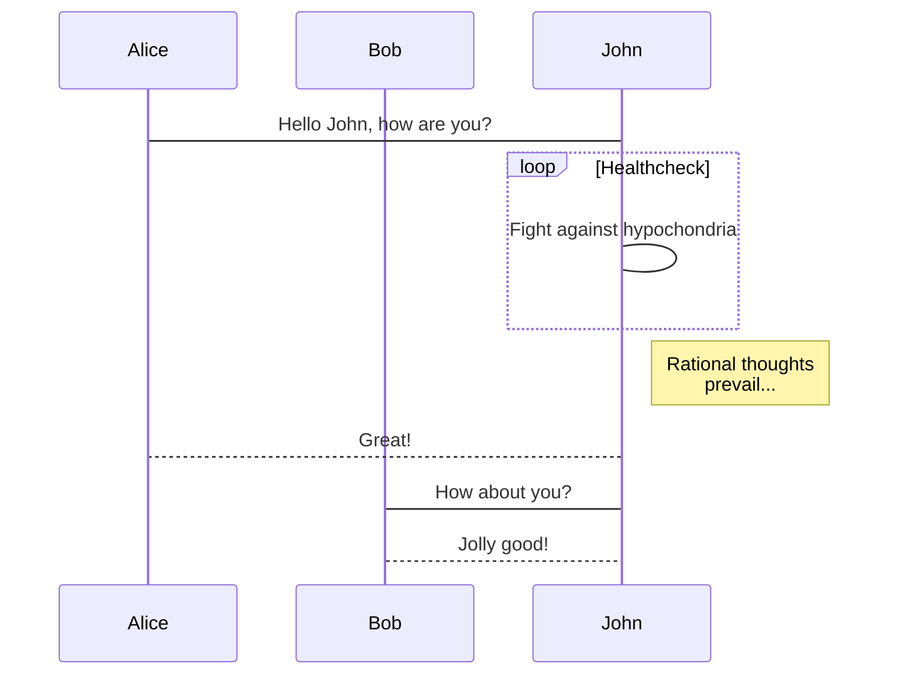
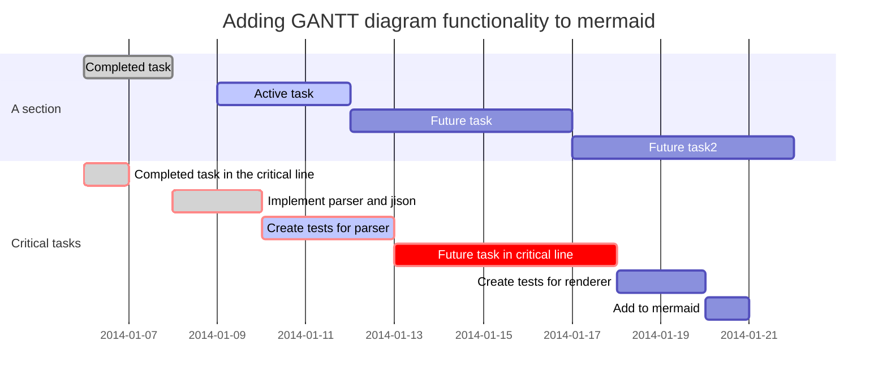

## 1. Headers

## Sub-heading

### Sub-sub heading

## 2. Text

Text attributes *italic*, **bold**, ~~delete~~, `inline code`, [Google](http://google.com)

> Reference

## 3. List

Bullet list:

* apples
  * apple1
* oranges
* pears

Numbered list:

1. wash  
  1.1 wash1
2. rinse
3. repeat

## 4. Paragraphs and lines

Paragraphs are separated
by a blank line.

Two spaces at the end of a line  
produces a line break.

Horizontal rule:

---

## 5. Images

使用图片时候语法与链接很像，但是链接位置要给出图片链接。图片链接可以使用免费图床上传上去进行生成。

1. [又拍云](https://www.upyun.com/)
2. [七牛云](https://portal.qiniu.com/)
3. Github  
  
上面两个都操作麻烦而且说不定哪天收费，现在可以将图片放在github仓库中，并将链接中的blob改为raw即可
展示如下：

* 本地  
  

* 网上链接  
  

* 自定义大小并居中  
  <div style="text-align: center">
  
  </div>
## 6. Codes

* Latex:  
  $|x|_1=\sum_{i=1}^n |x|$
* HTML:  
  Inline <abbr title="Hypertext Markup Language">HTML</abbr> is supported.
* javascript  
  
```javascript
  function fancyAlert(arg) {
    if(arg) {
      $.facebox({div:'#foo'})
    }
  }
```

## 7. Tables

| First Header                | Second Header                |
| --------------------------: | :--------------------------: |
| Right                       | Middle                       |
| Content in the first column | Content in the second column |

## 8. Task Lists

- [ ] @mentions, #refs, [links](), **formatting**, and <del>tags</del> supported
- [x] list syntax required (any unordered or ordered list supported)
- [x] this is a complete item
- [ ] this is an incomplete item

## 9. [Meraid](https://mermaidjs.github.io/)

* flowchart


* sequence



* gantt diagram


## 10. Extentions

* Markdown PDF/html/png  
  * F1 > Type 'export'
  * Right click
* Markdown All in One  
  | Shortcut         | Meaning                      |
  | ---------------: | :--------------------------: |
  | Ctrl + B         | Toggle bold                  |
  | Ctrl + I         | Toggle italic                |
  | Alt + S          | Toggle strikethrough         |
  | Ctrl + Shift + ] | Toggle heading (uplevel)     |
  | Ctrl + Shift + [ | Toggle heading (downlevel)   |
  | Ctrl + M         | Toggle math environment      |
  | Alt + C          | Check/Uncheck task list item |

* markdownlint
  * style check
  * hints: ctrl+shift+M or green wave
  
* Markdown Preview Mermaid Support  
  Create diagrams in markdown using mermaid code blocks
